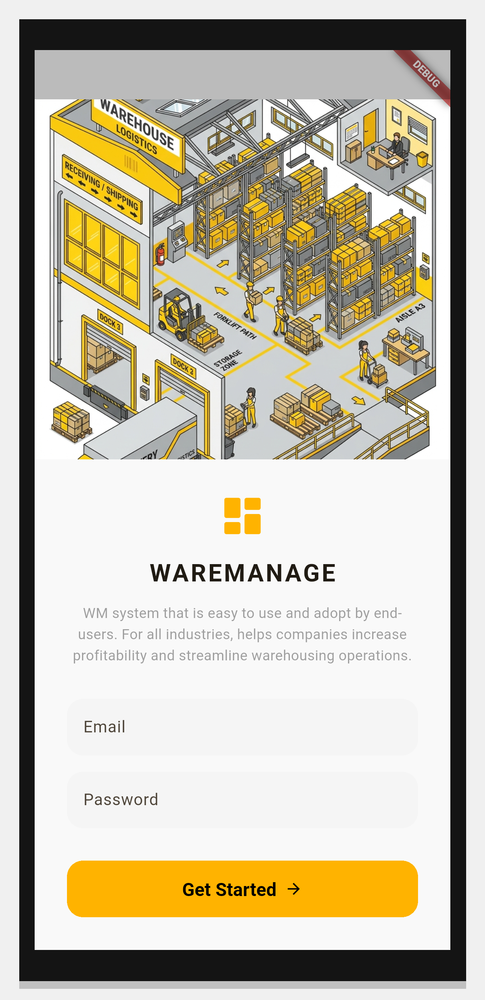
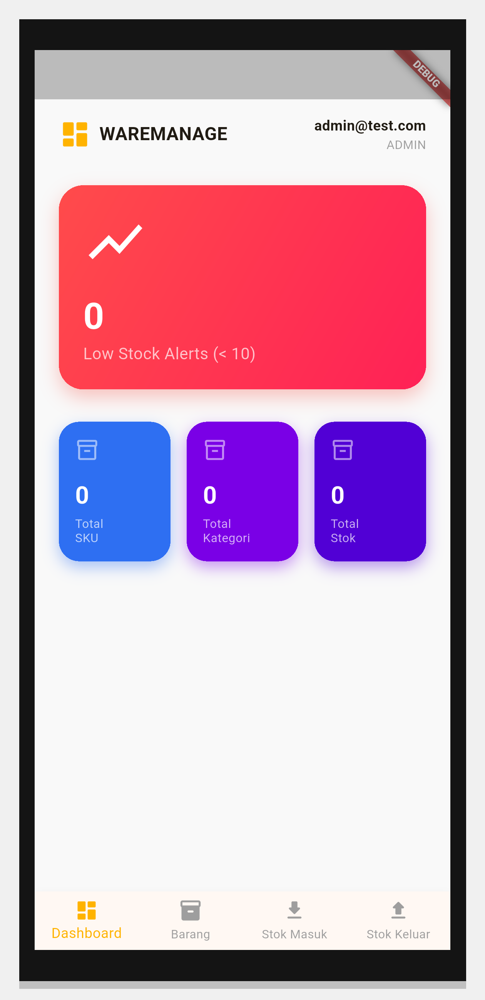

# Simple Warehouse Management System

A cross-platform Flutter application (Android & Web) designed for simple and efficient warehouse inventory management.

## Features
- **Role-Based Authentication:** 
  - **Admin:** Can create, edit, and safely delete items from the Master Barang.
  - **Operator:** Can only view items and process Stock In / Stock Out transactions.
- **Master Barang (Inventory Management):** Full CRUD functionality for products, featuring a strict safety lock that prevents the deletion of any item that has existing transaction history.
- **Real-Time Dashboard:** View low-stock alerts and recent inventory movements at a glance.
- **Barcode Scanning:** Built-in camera barcode scanning (supporting both Android and Web) for instant item lookup and transaction entry.
- **CSV Reporting:** Generate and download `.csv` transaction reports directly to your local Android device or Web browser.

## Screenshots
These screenshots are automatically generated, framed, and committed by our CI/CD pipeline!

| Login Screen | Dashboard |
|---|---|
|  |  |

## Default Test Credentials
The app uses reqres.in for mock authentication.
- **Operator (Standard):**
  - Email: `eve.holt@reqres.in`
  - Password: `cityslicka`
- **Admin:**
  - Email: `admin@test.com` (Use the same password to simulate an Admin login).

## Setup & Running Locally

1. **Install Dependencies:**
   ```bash
   flutter pub get
   ```

2. **Web Database Setup:**
   Because this app uses SQLite on the Web, you must compile the WebAssembly SQLite binaries before running the web app for the first time:
   ```bash
   dart run sqflite_common_ffi_web:setup --force
   ```

3. **Run the App:**
   - Android: `flutter run -d android`
   - Web: `flutter run -d chrome`

## CI/CD Pipeline (GitHub Actions)
This project is configured with an automated CI/CD pipeline using GitHub Actions. Upon pushing or merging to the `main` branch, the pipeline will automatically:
1. **Build Flutter Web** and deploy it directly to **GitHub Pages** for live web access.
2. **Build an Android APK** and attach it to a new **GitHub Release** (tagged as `latest`) so users can easily download the installable `.apk` file.

*Note: The GitHub Actions workflow automatically runs the required database setup command (`dart run sqflite_common_ffi_web:setup --force`) before building the web release.*
